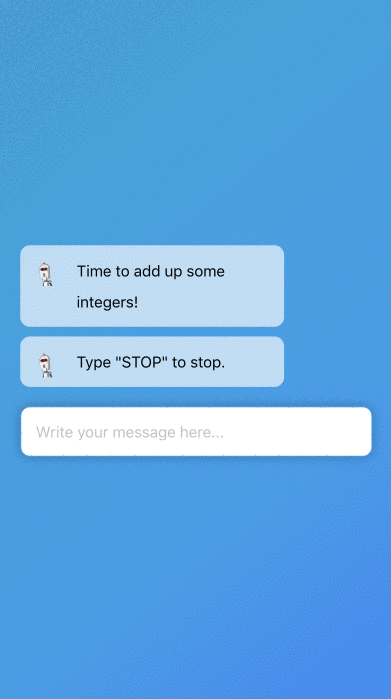

# NanoChat

Writing command line programs that take user input is kind of like creating a simple chatbot. With NanoChat, you can turn those programs into web-based chatbots.

1. Create chatbots using programming skills you already know. No need to learn a new framework.
2. Share your chatbot with anyone who has a browser, not just command line users.

## Demo

Try out a live chatbot [here](https://mimirchat.glitch.me).



This example program adds up numbers from the user. You can view more in the `/examples` folder.

```python
def main(bot):
    total = 0
    bot.send('Time to add up some integers!')
    bot.send('Type "STOP" to stop.')
    while True:
        message = bot.get()
        if message.lower() == 'stop':
            break
        try:
            num = int(message)
            total = total + num
            bot.send('Your new total is %d' % total)
        except Exception:
            bot.send('That is not an integer :(')
    bot.send('See you later!')
```

## Instructions

1. Download the `/nanochat` directory of this repository.
2. Write a chatbot in `chat.py`. See [API](#api) for details.
3. Test the chatbot by running it via the command line.

```
$ python chat.py
```

4. Run the chatbot as a web service.

```
$ python server.py
```

5. Deploy the chatbot on your favorite platform.
6. Share the URL with others!

## API

The chatbot has two methods:

### bot.send(message)

Sends `message` (string) to the user as a chat message.

```python
bot.send('Hi, how can I help you today?')
```

### bot.get(prompt)

Sends `prompt` (string) to the user, waits for input from the user, and returns their response (string).

```python
message = bot.get('Say something to me: ')
print('I heard the user say:')
print(message)
```
